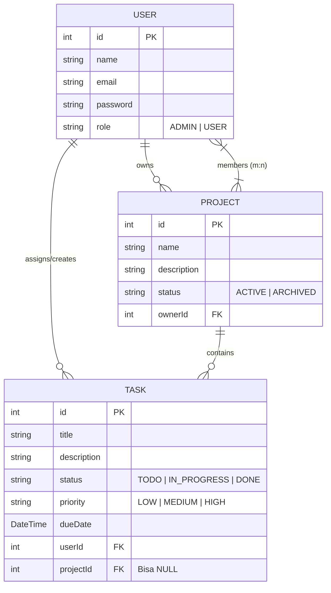
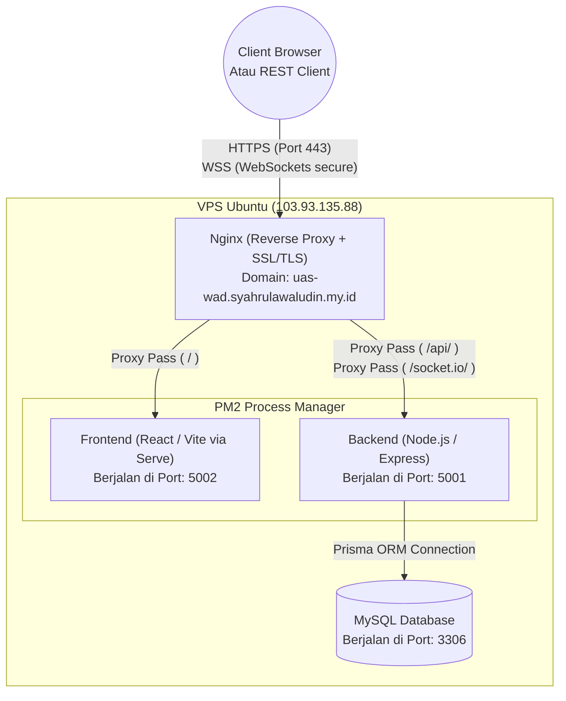
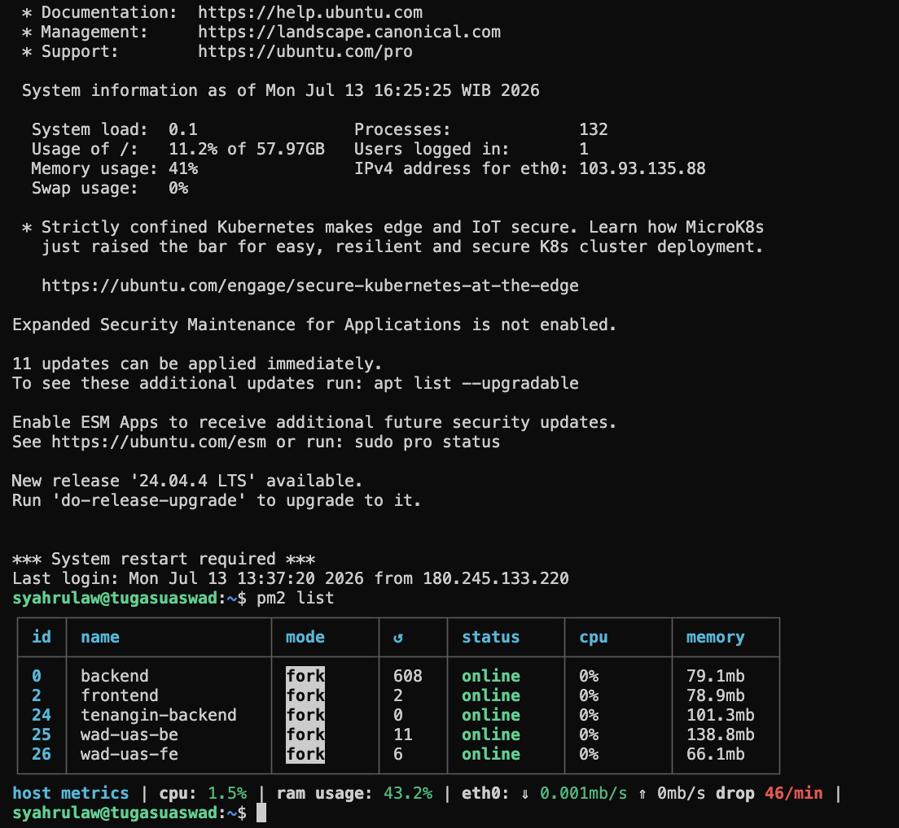
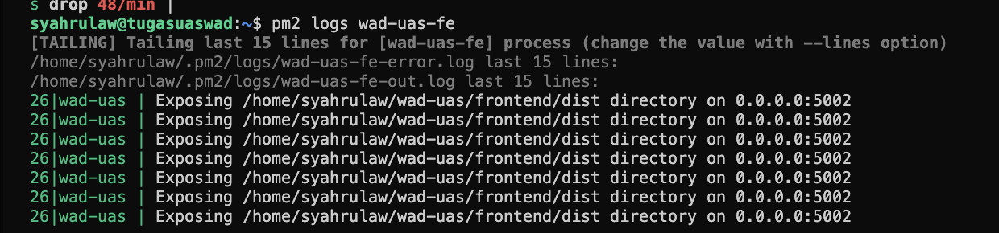
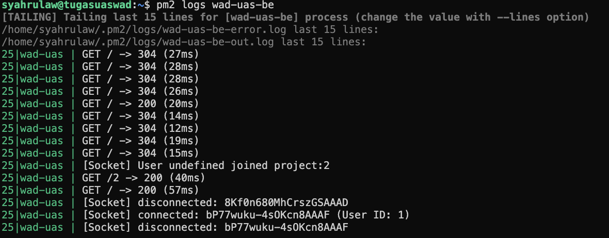

# WAD Capstone API - Backend

> 📚 **Live API Documentation (Swagger):** [https://uas-wad.syahrulawaludin.my.id/api/docs](https://uas-wad.syahrulawaludin.my.id/api/docs)

Repositori ini berisi *source code* untuk Backend aplikasi **WAD Task Manager**, yang dikembangkan untuk memenuhi tugas akhir (UAS) mata kuliah Web Application Development.

## 🚀 Teknologi yang Digunakan
- **Node.js & Express.js**: Framework backend untuk membangun RESTful API.
- **Prisma ORM**: Object-Relational Mapping (ORM) modern untuk berinteraksi dengan database MySQL.
- **Socket.IO**: Menyediakan fitur *Real-Time Communication* (WebSocket) untuk kolaborasi pengguna.
- **Argon2**: Algoritma enkripsi *password* modern.
- **JSON Web Token (JWT)**: Untuk Autentikasi dan Otorisasi (*Access Token* & *Refresh Token*).

## 🏗️ Arsitektur Proyek (Clean Architecture)
Backend ini secara disiplin menerapkan **Layered Architecture (Clean Architecture)**:
- **`routes/`**: Mendefinisikan rute HTTP.
- **`controllers/`**: Menerima *request*, merakit *response* JSON, dan menyerahkan tugas logika ke *Service*.
- **`services/`**: Memproses *Business Logic* (otorisasi hak akses, manipulasi data, _Socket.IO emit_).
- **`repositories/`**: Lapisan abstraksi Database menggunakan Prisma ORM.
- **`middlewares/`**: Filter permintaan (misal: otentikasi JWT).

---

## 📦 Panduan Setup Lokal

1. Pastikan **Node.js (v18+)** dan server database **MySQL** berjalan di mesin lokal Anda.
2. Clone repositori ini dan masuk ke folder `Backend`:
   ```bash
   git clone <repo_url>
   cd Backend
   ```
3. Install semua *dependencies*:
   ```bash
   npm install
   ```
4. Buat file `.env` di akar folder (ambil referensi dari `.env.example`):
   ```env
   PORT=5001
   DATABASE_URL="mysql://<user>:<password>@localhost:3306/wad_uas"
   JWT_ACCESS_SECRET="rahasia_access_capstone_123"
   JWT_REFRESH_SECRET="rahasia_refresh_capstone_123"
   ```
5. Sinkronisasi skema Prisma ke database:
   ```bash
   npx prisma db push
   ```
6. (Opsional) Isi database dengan data dummy awal (*Seed*):
   ```bash
   npx prisma db seed
   ```
7. Jalankan *server* dalam mode pengembangan:
   ```bash
   npm run dev
   ```

---

## 📡 Daftar Endpoint API (Ringkasan)

> Anda dapat menguji seluruh endpoint ini secara interaktif via antarmuka Swagger UI di `GET /api/docs`.

### Authentication
- `POST /api/v1/auth/register` - Pendaftaran akun baru
- `POST /api/v1/auth/login` - Login untuk mendapatkan Access & Refresh Token
- `POST /api/v1/auth/refresh` - Mendapatkan token baru
- `POST /api/v1/auth/logout` - Keluar sistem
- `GET /api/v1/auth/me` - Mendapatkan informasi profil diri

### Tasks
- `GET /api/v1/tasks` - Menampilkan daftar tugas (beserta filter & pagination)
- `POST /api/v1/tasks` - Membuat tugas baru
- `GET /api/v1/tasks/:id` - Melihat detail sebuah tugas
- `PUT /api/v1/tasks/:id` - Mengganti seluruh data tugas (Replace)
- `PATCH /api/v1/tasks/:id` - Memperbarui sebagian data tugas (Update)
- `DELETE /api/v1/tasks/:id` - Menghapus tugas

### Projects
- `GET /api/v1/projects` - Menampilkan daftar proyek kolaborasi
- `POST /api/v1/projects` - Membuat proyek baru
- `GET /api/v1/projects/:id` - Melihat detail proyek
- `PATCH /api/v1/projects/:id` - Memperbarui proyek
- `DELETE /api/v1/projects/:id` - Menghapus proyek
- `POST /api/v1/projects/:id/members` - Menambahkan anggota email ke proyek

---

## 🔌 Daftar Event Socket.IO (Real-Time)

Aplikasi ini menggunakan WebSockets untuk memantau perubahan data.

### **Events yang didengarkan oleh Server:**
- `project:join` (payload: `projectId`) - Client bergabung ke _room_ spesifik proyek.
- `project:leave` (payload: `projectId`) - Client keluar dari _room_ spesifik proyek.

### **Events yang dipancarkan (_emit_) oleh Server ke Klien:**
- `users:online` - Terpancar secara _broadcoast_ untuk menampilkan jumlah pengguna _online_.
- `task:created` - Dipancarkan ke _room_ user/proyek saat tugas baru dibuat.
- `task:updated` - Dipancarkan saat ada perubahan detail atau status tugas.
- `task:deleted` - Dipancarkan saat tugas dihapus.
- `project:created` - Dipancarkan ke user saat diundang ke proyek baru.
- `project:updated` - Dipancarkan ke seluruh anggota saat proyek diperbarui.
- `project:deleted` - Dipancarkan saat proyek dihancurkan.

---

## 📊 ERD Database (Entity Relationship Diagram)

Sistem database terdiri dari 3 entitas utama: `User`, `Project`, dan `Task`. 
Relasi *Many-to-Many* diterapkan untuk menghubungkan anggota (*members*) ke *Project*.



---

## ☁️ Arsitektur Deployment (VPS Production)

Aplikasi dipublikasikan ke Virtual Private Server (Ubuntu) menggunakan konfigurasi **Reverse Proxy Nginx** yang menavigasi trafik ke **PM2** (_Process Manager_). Nginx juga digunakan untuk terminasi *SSL/HTTPS* melalui Certbot.



### Penjelasan Alur Deployment:
1. **GitHub Actions (CI/CD)**: Segala perubahan kode yang di-*push* ke cabang `master`/`main` akan secara otomatis memicu skrip deployment di VPS.
2. **Nginx**: Berfungsi sebagai tameng terdepan. Jika URL berupa `/` (halaman web biasa), ia melempar trafiknya ke proses PM2 Frontend. Jika URI mengandung awalan `/api/` atau `/socket.io/`, ia melempar trafik ke PM2 Backend.
3. **PM2**: Memastikan kedua aplikasi (BE & FE) berjalan tanpa henti (sebagai _daemon_ atau servis _background_). Jika aplikasi _crash_, PM2 akan secara otomatis menghidupkannya kembali.
4. **MySQL Database**: Berjalan di belakang layar secara aman (`localhost`). Tidak bisa diakses oleh dunia luar secara langsung melainkan hanya via Backend.

---

## 📸 Dokumentasi Server (Screenshots)

Berikut adalah beberapa tangkapan layar (screenshot) dari terminal VPS yang membuktikan proses *deployment* dan status aplikasi berjalan 100% *online* menggunakan PM2:

### 1. Daftar Proses PM2 Keseluruhan
Menampilkan daftar proses `wad-uas-be` dan `wad-uas-fe` yang sedang berjalan.


### 2. Status PM2 Frontend
Menampilkan detail status memori dan log untuk *Frontend*.


### 3. Status PM2 Backend
Menampilkan detail status memori dan log untuk *Backend*.

